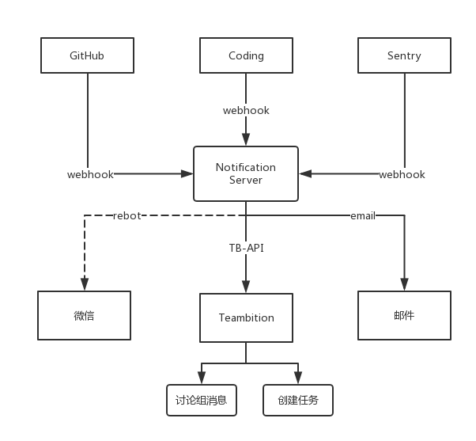

# Notification

项目消息通知管理系统，支持 Coding、GitHub 提交记录、Sentry 报警消息输出到Teambition 讨论组或者以邮件的方式发送给项目干系人，Sentry 的报警可以自动创建 Teambition Bug 任务指派给指定任务人。

地址： http://notification.yousails-project.com/

使用文档：https://todayqq.gitbooks.io/notification/content/

如有发现 Bug 或者有更好的建议，发送邮件至 angkee@qq.com

## 特点
- Coding、GitHub、Sentry 等第三方平台消息的接入
- Teambition Oauth 授权，讨论组消息推送
- Teambition Bug 任务自动创建，并指派给相关任务人
- email 通知
- 支持用户以及权限管理

### 流程图



## 扩展包依赖

| 扩展包 | 一句话描述 |
| --- | --- | 
| [spatie/laravel-backup](https://github.com/z-song/laravel-admin.git)| Laravel-admin 管理后台 |
| [spatie/laravel-admin](https://github.com/spatie/laravel-backup.git)| 数据库备份 |
| [orangehill/iseed](https://github.com/orangehill/iseed)| 将数据表里的数据以 seed 的方式导出 |
| [rap2hpoutre/laravel-logviewer](https://github.com/rap2hpoutre/laravel-log-viewer)| Log 查看工具 |
| [getsentry/sentry-laravel](https://github.com/getsentry/sentry-laravel)| Sentry 错误报警 |

## 环境介绍

- Nginx 1.9+
- PHP 7.0+
- Mysql 5.7+
- Laravel 5.4

## 开发环境部署/安装

本项目代码使用 [Laravel Framework](http://laravel.com/) 进行开发,本地开发环境使用 [Laravel Homestead](http://laravel-china.org/docs/5.4/homestead) 进行快速部署.

下文将在假定读者已经安装好了 Homestead 的情况下进行说明. 如果您还未安装 Homestead, 可以参照 [Laravel Homestead Installation & Setup](http://laravel-china.org/docs/5.4/homestead#installation-and-setup) 进行安装配置.

### 基本安装

1. 克隆源代码

将源代码克隆到 `notification` 文件夹下

> git clone https://github.com/todayqq/notification.git

2. 配置本地的 Homestead 环境

1). 编辑 Homestead.yaml 文件

```shell
homestead edit
```

2). 加入对应修改,如下所示:

```
folders:
- map: ~/Projects/notification/ # 你本地的项目目录地址
to: /home/vagrant/notification

sites:
- map: notification.app
to: /home/vagrant/notification/public

databases:
- notification
```

3). 应用修改

```shell
homestead provision
```

3. 安装依赖
> composer install

4. 生成配置文件
> cp .env.example .env

你可以根据 .env 的文件内容进行相应修改,如数据库连接、缓存设置等内容

```
APP_URL=http://notification.app
...
DB_HOST=localhost
DB_DATABASE=notification
DB_USERNAME=homestead
DB_PASSWORD=secret

DOMAIN=.notification.app

MAIL_DRIVER=smtp
MAIL_HOST=smtp.mailtrap.io
MAIL_PORT=2525
MAIL_USERNAME=null
MAIL_PASSWORD=null
MAIL_ENCRYPTION=null

TBAPP_KEY=
TBAPP_SECRET=

```

5. 创建数据表及生成测试数据

在 Homestead 的网站根目录下运行以下命令

```shell
php artisan admin:install
php artisan migrate --seed
```
6. 配置 hosts 文件
> sudo vi /etc/hosts

添加如下内容
> 192.168.10.10 notification.app


### 前端框架安装

1. 安装 node.js

直接去官网 [https://nodejs.org/en/](https://nodejs.org/en/) 下载最新版本即可

2. 安装 Gulp

```shell
npm install --global gulp
```

3. 安装 Laravel Elixir

```shell
npm install
```

4. 安装 bower

```shell
npm install --global bower
```

5. 运行 bower 下载前端组件包

```shell
bower install
```

6. 直接 Gulp

```shell
gulp
```


管理后台地址: http://notification.app. 管理员账号密码如下:

> username: admin
>
> password: admin

至此, 安装完成 ^_^.